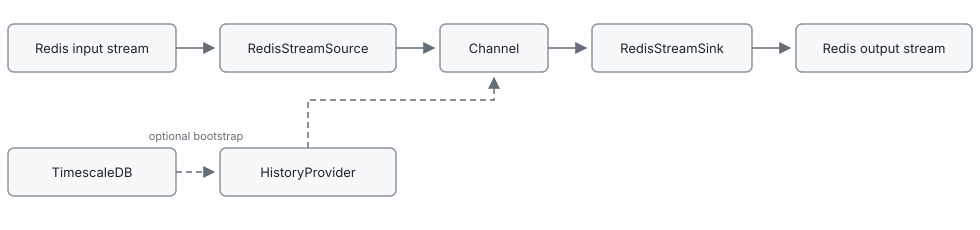
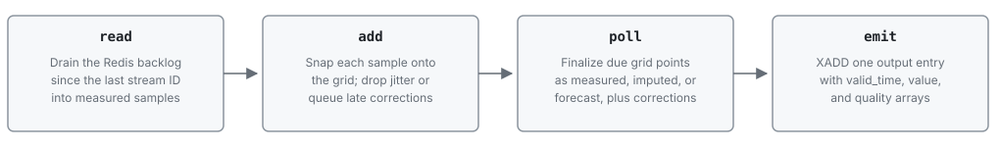

# RDP Regularizer

Measurement streams from the data crawler arrive on Redis with jittery timestamps and gaps. This service reads those streams, snaps samples onto a UTC grid `epoch + k * update_interval` (epoch is 1970-01-01), fills missing steps by imputation or forecast, and writes a strictly regular output stream that downstream consumers can unpack. Each configured channel runs in its own worker thread. Optional TimescaleDB history can bootstrap the in-memory window at startup so the grid does not start empty.

Requires Python `>=3.10`.

## How it works

[`TimeGridRegularizer`](regularizer/regularizer.py) advances a monotonic frontier. Each grid point is finalized once, in order, as **measured**, **imputed**, or **forecast**. Late measured values may re-emit corrections that upgrade imputed/forecast points still held in the in-memory window; the frontier does not rewind.

- Incoming samples snap to the nearest grid point when `|timestamp - grid| <= jitter_tolerance` (default `0.5 * update_interval`). If several samples map to the same point, the closest wins; farther ones are dropped.
- **measured** — a snapped sample is pending for that grid point.
- **imputed** — an interior gap: later measured data is already pending. The `default` imputer is last observation carried forward (else the bounding next sample, else NaN).
- **forecast** — no data by the deadline `grid_time + lag_time`. The `default` forecaster repeats the last history value (else NaN).
- Optional TimescaleDB bootstrap replays raw history into that window and publishes it to the output stream before live polling starts.

## Architecture

Each poll tick drains the Redis backlog, regularizes onto the grid, and writes one output entry.



Each scheduled tick runs `Channel._step`:



Polling is aligned to `epoch + k * polling_interval + offset`.

## Package layout

| Path | Role |
|------|------|
| [`regularizer/__main__.py`](regularizer/__main__.py) | CLI: load config, start channel threads |
| [`regularizer/channel.py`](regularizer/channel.py) | Per-channel scheduler and I/O wiring |
| [`regularizer/regularizer.py`](regularizer/regularizer.py) | Time-grid regularization and late corrections |
| [`regularizer/config.py`](regularizer/config.py) | `ChannelConfig` / `HistoryProviderConfig` |
| [`regularizer/io/`](regularizer/io/) | Redis stream source and sink |
| [`regularizer/history/`](regularizer/history/) | Timescale fetch and in-memory history store |
| [`regularizer/tools/`](regularizer/tools/) | Imputer and forecaster registries |

## Configuration

The process loads YAML through `pyrdp_commons.cli.setup_app`. Paths can be set on the CLI or via environment variables:

| Option | Env var | Default | Role |
|--------|---------|---------|------|
| `-c` / `--config` | `REGULARIZER_CONFIG` | `config.yml` | YAML config file |
| `--env` | `REGULARIZER_ENV` | unset | optional dotenv file for `!env-template` substitution |

YAML values may use `!env-template "${VAR}"` (see [`docker/etc/regularizer/config.yml`](docker/etc/regularizer/config.yml)). A full example is in [`docs/config.md`](docs/config.md).

**Durations** (`ms`, `s`, `m`, `h`, `d`, `w`, e.g. `30s`, `1m`); bare numbers are seconds.

| Section | Keys |
|---------|------|
| `redis` | `host`, `port`, `db`, optional `password` |
| `timescale` | `host`, `port`, `db`, `user`, `password` — required if any channel has `history_provider` |
| `channels.<name>` | required: `input_stream`, `output_stream`, `polling_interval`, `update_interval`, `window` |
| | optional: `jitter_tolerance`, `offset`, `lag_time`, `output_maxlen` (200), `data_provider_name` (`rdp-regularizer`), `imputer` / `forecaster` (`default`) |
| `history_provider` | omit or `null` to skip bootstrap; else `dp_name` plus optional `dp_location_code`, `dp_unit`, `dp_data_provider`, `dp_device_id`, `init_when_source_available`, `bootstrap_delay` (default `10s`) |

## Redis I/O

**Input** ([`regularizer/io/source.py`](regularizer/io/source.py)): JSON fields `_time` and `_value` (scalar or arrays of equal length); optional `_metadata`. The cursor starts at the current stream tip, so Redis history is not replayed. Malformed entries are skipped and the cursor still advances.

**Output** ([`regularizer/io/sink.py`](regularizer/io/sink.py)): one `XADD` per poll batch, `maxlen=output_maxlen`, `approximate=True`. Fields are JSON arrays `valid_time`, `value`, `quality`. `data_provider` is `data_provider_name`. With a history provider, identity fields (`name`, `location_code`, `unit`, `device_id`) come from `dp_*` when set; otherwise `name` is the channel key.

## Run

Copy the example from [`docs/config.md`](docs/config.md) to `config.yml`, then:

```
uv sync
python -m regularizer
```

Override paths with `-c` / `--config` and `--env`, or with `REGULARIZER_CONFIG` and `REGULARIZER_ENV`:

```
python -m regularizer -c /path/to/config.yml --env /path/to/.env
REGULARIZER_CONFIG=/path/to/config.yml REGULARIZER_ENV=/path/to/.env python -m regularizer
```

Ctrl+C sets the stop event and joins channel threads (10s timeout). Logging is configured from the same YAML via pyrdp-commons.

## Development

```
uv run pytest
```

[`pyproject.toml`](pyproject.toml) sets Hatchling `allow-direct-references` so the git `pyrdp-commons` dependency can be built.
